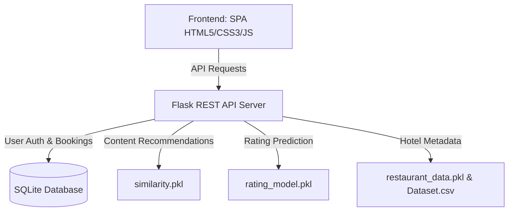

# Implementation Plan - Hotel Reservation and Recommendation System

We are building a complete, high-end, and intelligent **Hotel Reservation and Recommendation System** integrated with pre-trained machine learning models and original datasets.

Because the C drive is completely full (0 GB free), the entire project—including SQLite databases, Python Flask backend, ML models integration, and modern frontend static assets—will be hosted and built on the **D drive** inside the workspace `d:\download movies\hotel booking`.

---

## User Review Required

> [!IMPORTANT]
> **Drive Allocation**: All project files, databases, and dependencies will be stored on the **D drive** inside the workspace. No new files will be written to the C drive, ensuring absolute safety against disk space errors.
>
> **Model Remapping**:
> - **Recommendation System**: We will load `similarity.pkl` (cosine similarity matrix of size 9551x9551) to find and recommend highly similar hotels based on user booking history and profile.
> - **Rating Prediction**: We will integrate the DecisionTreeRegressor (`rating_model.pkl`) to predict hotel ratings based on 15 features.
> - **Location-based suggestions**: We will build a hybrid location model utilizing the coordinates (`Latitude`, `Longitude`) and cities from the dataset to filter and rank hotels near a user's location.

---

## Proposed System Architecture

### 1. Backend: Flask REST API (`app.py`)
A fast and lightweight REST API that handles:
- **Authentication**: Secure registration, login, and session tokens for both normal Users and Administrators.
- **Model Orchestration**:
  - **Similarity Engine**: Recommends hotels by reading the 729MB `similarity.pkl` array.
  - **Rating Predictor**: Runs predictions via `rating_model.pkl` Decision Tree.
  - **Location Filter**: Computes distance metrics using coordinates and filter hotels based on target location.
- **Database (SQLite)**:
  - Users table (id, username, password_hash, email, role, created_at).
  - Hotels table (id, name, city, address, locality, cuisines, average_cost, currency, price_range, latitude, longitude, aggregate_rating, rating_color, rating_text, votes, available_rooms, image_url, is_deleted).
  - Bookings table (id, user_id, hotel_id, room_type, check_in_date, check_out_date, total_price, status, created_at).
  - Analytics table/query helper.

### 2. Frontend: Premium Dark-Themed SPA (`static/`)
A single-page, state-of-the-art dark mode UI (deep purples, indigo, glassmorphic card elements, smooth micro-animations).
- **Core Technology**: HTML5, Vanilla CSS3 (curated colors, Outfit/Inter typography, gradients), Vanilla Javascript (ES6+).
- **Chart.js Integration**: Beautiful real-time admin analytics (most booked hotels, rating distribution, booking stats).
- **Modules**:
  - **Auth View**: Glass-morphic flip cards for user registration, user login, and admin login.
  - **User Dashboard**:
    - Filterable grid with search, locality filtering, price sorting, and rating sorting.
    - **Intelligent Suggestions**: Dynamically displays recommended hotels based on similarity to their previous bookings, or top-rated ones.
    - **Booking Calendar**: Fully functional interactive modal to reserve slots.
    - **Booking History**: Allows cancellation, tracks status of booking requests.
  - **Admin Dashboard**:
    - **Analytics View**: Interactive charts showcasing most booked hotels, average pricing, rating distribution, and prediction metrics.
    - **Listings Manager**: Complete CRUD operations. When adding a new hotel, the admin can input location and cost, and the system will run `rating_model.pkl` to *predict* and pre-fill its rating automatically!
    - **Bookings Manager**: Approve or reject user reservations.

---

## Proposed Changes

We will create the following files inside `d:\download movies\hotel booking`:

### [NEW] [app.py](file:///d:/download%20movies/hotel%20booking/app.py)
The core Python Flask application housing the REST APIs, model loaders, database schema, seeding code, and routing.

### [NEW] [static/index.html](file:///d:/download%20movies/hotel%20booking/static/index.html)
Main markup containing semantic sections for user dashboard, admin dashboard, authentication panels, modals, and charts.

### [NEW] [static/style.css](file:///d:/download%20movies/hotel%20booking/static/style.css)
Visual skin using rich palettes (indigo, purple, charcoal blacks), glassmorphic styling, neon glows, responsive layouts, and responsive font-scaling.

### [NEW] [static/app.js](file:///d:/download%20movies/hotel%20booking/static/app.js)
Frontend logic handling views routing, AJAX API requests to Flask, dynamically rendering hotel lists, interactive calendar validation, Chart.js setup, and local sessions.

---

## Verification Plan

### Automated / Execution Tests
1. **Server Startup**: Run `python app.py` and verify models are successfully loaded into memory without memory crashes or timeouts.
2. **Database Seeding**: Check if SQLite is populated correctly with all hotels from the CSV.
3. **API Tests**:
   - Test register & login endpoints.
   - Test the recommendation endpoint with multiple hotel indices.
   - Test the rating prediction endpoint with standard inputs.

### Manual Verification
1. Launch the site in the browser.
2. Register as a user, browse hotels, and filter by city.
3. Click on a hotel, see similar hotels recommended instantly below it, select dates, and request a booking.
4. Log out, log in as an administrator, go to the Admin Dashboard.
5. Review the analytics charts, approve the booking, and see the user's booking status change.
6. Try adding a new hotel, click "Predict Rating" to verify the machine learning model output, and create the listing.
