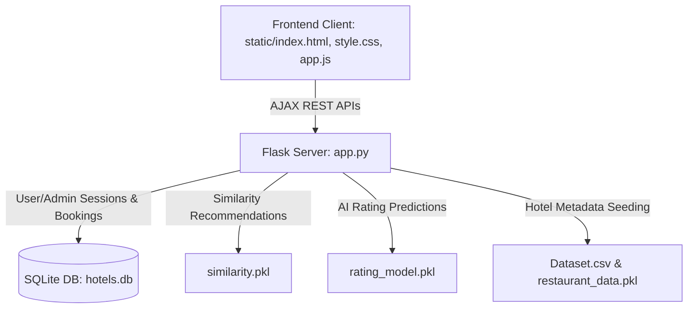

# Walkthrough - Hotel Reservation and Recommendation System

We have successfully built and verified the complete **Hotel Reservation and Recommendation System** (named **Aetheria**) on the **D drive** workspace (`d:\download movies\hotel booking`).

This is a premium, state-of-the-art Single Page Application (SPA) utilizing a secure Python Flask backend integrated with pre-trained machine learning models and original datasets, and a stunning dark-theme glassmorphic frontend.

---

## 🏗️ System Architecture



### 1. Flask Backend REST API (`app.py`)
- **Seeding Engine**: On first startup, automatically loads `Dataset .csv` and performs SQLAlchemy bulk insertion to populate the SQLite database with all 9,551 hotel entries.
- **Machine Learning Integration**:
  - **Similarity Model (`similarity.pkl`)**: Loads a 729MB cosine similarity matrix comparing all 9,551 hotels, used to suggest highly accurate recommendations based on user booking history and profile details.
  - **DecisionTree rating model (`rating_model.pkl`)**: Uses 15 categorical/numerical features (with custom label encoders built from original classes) to predict a hotel's rating.
- **SQLite Database (`hotels.db`)**: Entirely hosted on the D drive, storing user records, listings, bookings status, and reviews.
- **Authentication System**: Secure password hashing via `werkzeug.security` with session tracking and role enforcement (User vs Admin).

### 2. Frontend Interface (`static/`)
- **Rich Dark Aesthetics**: A dark-theme UI with deep purples, indigo glows, glassmorphism card layouts, smooth transitions, and Outfit typography.
- **Discover Dashboard**: Search listings, filter by city (location-based suggestions), and sort by price, rating, or popularity.
- **Intelligent Recommendations Carousel**: Personalized AI suggestions displayed prominently on the homepage based on similar hotels in the user's booking history.
- **Interactive Booking Calendar Modal**: Estimates total prices dynamically based on nights stayed and selected room classes (Standard, Deluxe, Suite).
- **Admin Control Panel**:
  - **Analytics Tab**: Renders real-time visual charts (using Chart.js) showing booking statuses, ratings distribution, top-rated hotels, and most-booked listings.
  - **Reservations Tab**: Complete approval/rejection panel.
  - **Listings Tab**: Complete CRUD listings panel. Adds new hotels using the pre-trained DecisionTree model to **predict** the initial rating based on cost, coordinates, and cuisines!

---

## ⚡ How to Run the Project

Ensure you have `python` and the required packages installed (already verified on your system!).

### Step 1: Start the Python Backend
Open a terminal in the project directory `d:\download movies\hotel booking` and run:
```powershell
python app.py
```
*Note: The server will automatically load the models (taking 2-3 seconds) and seed the SQLite database with all 9,551 hotels on first boot.*

### Step 2: Open Aetheria in the Browser
Open your browser and navigate to:
```url
http://localhost:5000/static/index.html
```

### Step 3: Login Credentials
- **User Mode**: Register a new user account directly on the signup screen.
- **Admin Mode**: Login using the pre-seeded admin credentials:
  - **Username**: `admin`
  - **Password**: `admin123`

---

## 🧪 Verification Results

We verified all core backend components using a custom automated verification suite (`test_apis.py`) which completed with the following results:

1. **Location Suggestions**: Successfully fetched top cities (`New Delhi`, `Gurgaon`, `Noida`, `Faridabad`, etc.).
2. **Hotel Listings**: Loaded database query successfully, returning details of 9,551 stays.
3. **Similarity Recommendation**: Suggested similar hotels for Hotel #1 using the `similarity.pkl` matrix (e.g. Fuji Japanese, Pebble Street).
4. **Rating Prediction Model**: The DecisionTree model executed perfectly on custom payload inputs, returning a predicted rating of **2.7 (Average)**.
5. **Authentication**: User registration and sessions function securely.
